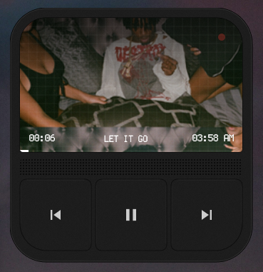

# Noro Player

**Noro Player** is a Rainmeter skin: a retro-styled, touch-friendly music player that shows your current track, album art, progress, and playback controls. It pairs with Windows media players through Rainmeter’s **NowPlaying** / **MediaPlayer** plugin (default player).

This repository (**[noro-player](https://github.com/SunkenInTime/noro-player)** on GitHub) contains the source; the packaged skin installs under the `RetroTouchPlayer` folder and uses the **`RetroTouchPlayer.rmskin`** installer filename.

## Preview

## Demo

<video src="https://raw.githubusercontent.com/SunkenInTime/noro-player/master/noro-demo.mp4" controls width="100%" poster="https://raw.githubusercontent.com/SunkenInTime/noro-player/master/player-preview.png"></video>

If the video does not play inline (for example before these files are on the default branch), open [`noro-demo.mp4`](noro-demo.mp4) locally or from the repo file list.

## Download (releases)

You do **not** need to use Git or understand the rest of this page to install the skin.

1. Open the **[Releases](https://github.com/SunkenInTime/noro-player/releases)** page for this project.
2. At the top, open the **latest** release (highest version number).
3. Under **Assets**, download **`RetroTouchPlayer.rmskin`** (a single installer file).

That page always lists every published version; “Latest” points to the newest build.

Direct link to the latest packaged file (same as the skin’s built-in updater):

[https://github.com/SunkenInTime/noro-player/releases/latest/download/RetroTouchPlayer.rmskin](https://github.com/SunkenInTime/noro-player/releases/latest/download/RetroTouchPlayer.rmskin)

## Requirements

- **Windows**
- **[Rainmeter](https://www.rainmeter.net/)** 4.5 or newer (see `MinimumRainmeter` in `RMSKIN.ini`)

## Installation

1. Install Rainmeter if you haven’t already.
2. Download **`RetroTouchPlayer.rmskin`** from [Releases](https://github.com/SunkenInTime/noro-player/releases) (see above).
3. Double-click **`RetroTouchPlayer.rmskin`** and confirm the install when Rainmeter prompts you.
4. In the Rainmeter **Manage** window, enable **Noro Player** under **Active skins** (or load `RetroTouchPlayer\Player.ini`).

The skin appears on the desktop; drag it where you want. Use the skin’s own controls for previous / play–pause / next. If nothing shows for title or art, ensure a supported player is running and playing (Rainmeter uses the configured “default” media session).

## Configuration

Player and layout options live in:

`RetroTouchPlayer\@Resources\Variables.inc`

There you can adjust the target player, fonts, colors, and layout. After editing, **refresh** the skin (middle-click the skin background, or refresh from Rainmeter).

## Repository layout

- **`RetroTouchPlayer/`** — skin (`Player.ini`, `@Resources`, etc.)
- **`RMSKIN.ini`** — package metadata for building the `.rmskin`
- **`latest.ini`** — version info used by the in-skin update check

Maintainers: see [`RELEASING.md`](RELEASING.md) for version bumps and automated releases.

## License

See **`RetroTouchPlayer/Player.ini`** metadata (`License=Personal use` as shipped).
